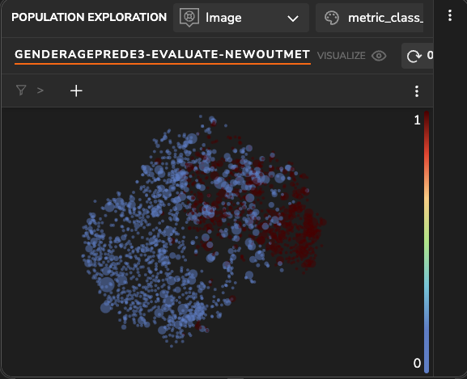
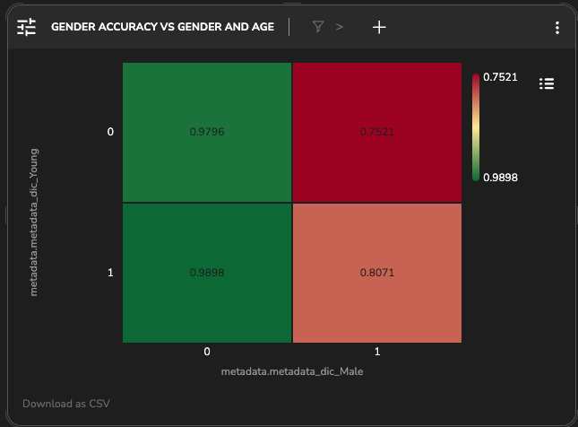
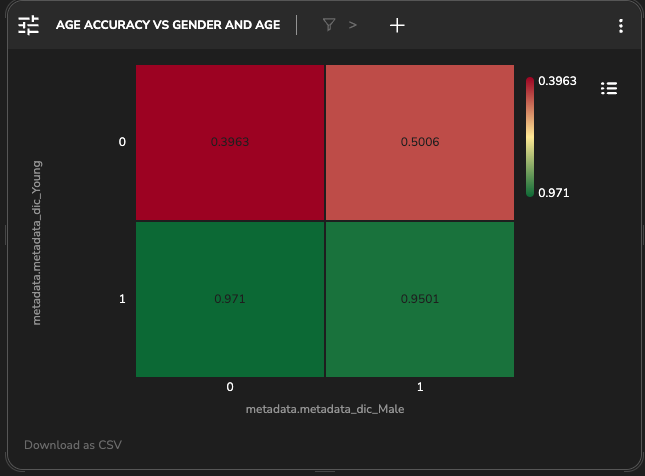

# CelebA Dataset Gender and Age Group Prediction with MobileNetV2


This project showcases a deep learning classification task for predicting the gender and age group of face individuals in images. We train a [MobileNetV2](https://arxiv.org/abs/1801.04381) model to perform this task on [CelebA](https://mmlab.ie.cuhk.edu.hk/projects/CelebA.html) benchmark using Keras and Tensorflow implementation.

### The Dataset

The dataset is a large-scale face dataset with attribute-based annotations. Cropped and aligned face regions are utilized as the training source. The data consist of 162,770 train images and 39,829 test images.

### Methods

Training the MobileNetV2, with initialized weights - pretrained on Imagenet, with a new head for the multi-label binary task. 

First, the model was trained for 5 epochs with a batch size of 64, on Binary Cross Entropy (BCE) loss, reaching to accuracy of 87.7% and loss value of 0.6497 for test set. 

Using Tensorleap we can easily debug and improve the model development process. This example project demonstrates how. 


### Latent Space Exploration

First, since the model's task is to classify the gender and age group based on face individuals in images we can significantly learn about the model's performance quality by investigating its latent space that TL creates for us automatically. 

**Gender Analysis**

We can color the samples by their actual label and we notice that the image samples are projected in such a way that most of 'Male' samples are within the right side and 'Female' samples tend to be are within the left side. Also, when coloring the samples based on the model's prediction we see the clear distinction in accordance to the actual label spread. 

_Model's Latent Space colored by Gender GT_

_Model's Latent Space colored by Gender Prediction_

**Age Analysis**

Looking at the differences for the actual Age labels vs the model's prediction it's clear-cut  that the model is weaker on this prediction task. The samples predicted as 'Non-Young' are mainly spread at the top whilst based on the actual label there isn't any clear distinction and both age groups spread in the space.

_Model's Latent Space colored by Age GT_

_Model's Latent Space colored by Age Prediction_

We plot using TL dashboard the accuracy per class and indeed the Gender accuracy is around 90.5% and the Age accuracy is around 84%.

_Gender and Age Accuracy_

From plotting the binary accuracy vs the actual labels, we see that the model is failing on the 'Non-Young' samples compared to the 'Young' samples. The accuracy for 'Non-Young' 'Male' cohort is the lowest in around 6% from the 'Non-Young' 'Female' cohort. In addition, on average, the model is weaker on 'Male' samples compared to 'Female'.


_Binray Accuracy per labels combination_
<div style="display: flex;">
  
  
</div>

_Gender and Age Accuracies per labels combination_

The data labels distribution  in the training set is imbalanced, particularly to 'Age'.  'Young' samples consist of around 77% of the data and 'Male' samples consist around of 42%.  

This might have caused the model to be more biased, likely to predict 'Female' and 'Young' rather than 'Male' and 'Non-Young' . Now we can fine-tune the model using a weighted loss function or by choosing a sampling method that will balance the distribution (upsampling/ downsampling) to improve the performance.


_Data samples count per label_


_Data samples count per labels combination_

We trained the model using a weighted BCE loss function based on the classes distributions. After finetuning the model we can compare in TL dashboard both models:

We see that the loss (used a non-weighted BCE loss function) is decreased by half from around 0.66 to 0.33. The Binary Accuracy is improved for around 90%, Gender Accuracy increased to 95.5% and Age accuracy increased to 86%.


_Accuracy and Loss (BCE): BCE-model (left) and Weighted-BCE model (right)_


_Gender and Age Accuracies: BCE-model (left) and Weighted-BCE model (right)_

Also, in terms of the four cohorts: the accuracy is much better for the 'Non-Young'-'Male' samples however the model is still failing on 'Non-Young'-'Female' which needs to be further investigated.


_Binary Accuracy for per labels combination: BCE-model (up) and Weighted-BCE model (bottom)_


## Sample Analysis


We can observe that the more 'Male-like' features the model extracts are around the chin and under eye and neck. 
When the more 'Women-like' features are around the hair. Interesting to see that the 'Young-like' features are similar to those who direct the prediction towards Woman.
This might be an important observation that that needs to be addressed and perhaps might explain why we found that the model is still failing on such population. 
The 'Non-Young' features are around the wrinkles which are in the forehead, in the neck, around eyebrows and the nose.


<div style="display: flex;">

  <div style="width: 50%;">
    
    <p align="center">Features direct the model towards 'Young' prediction</p>
  </div>

  <div style="width: 50%;">
    
    <p align="center">Features direct the model towards 'Non-Young' prediction</p>
  </div>

</div>

<div style="display: flex;">

  <div style="width: 50%;">
    
    <p align="center">Features direct the model towards 'Male' prediction</p>
  </div>

  <div style="width: 50%;">
    
    <p align="center">Features direct the model towards 'Female' prediction</p>
  </div>

</div>

To assess it, we split the confusion matrix for the Age prediction and indeed we see that the model tends to falsely predict for 'Female' samples as being 'Young' (FP) (left matrix).


# Project Quick Start

## Tensorleap CLI Installation

#### Prerequisites

Before you begin, ensure that you have the following prerequisites installed:

- [Python](https://www.python.org/) (version 3.7 or higher)

- [Poetry](https://python-poetry.org/)

<br>

with `curl`:

```

curl -s <https://raw.githubusercontent.com/tensorleap/cli-go/master/install.sh> | bash

```

with `wget`:

```

wget -q -O - <https://raw.githubusercontent.com/tensorleap/cli-go/master/install.sh> | bash

```

- CLI repository: https://github.com/tensorleap/leap-cli

## Tensorleap CLI Usage

### Tensorleap Login

To login to Tensorealp:

```

leap auth login [api key] [api url].

```

- See how to generate a CLI token [here](https://docs.tensorleap.ai/platform/resources-management)

## Tensorleap Project Deployment

Navigate to the project directory.

To push your local project files (model + code files):

leap projects push <modelPath> [flags]

To deploy only the project's code files: 

```

leap code push

```

### Tensorleap files

Tensorleap files in the repository include `leap_binder.py` and `leap.yaml`. The files consist of the required configurations to make the code integrate with the Tensorleap engine:

leap.yaml

leap.yaml file is configured to a dataset in your Tensorleap environment and is synced to the dataset saved in the environment.

For any additional file being used we add its path under `include` parameter:

```

include:

 - leap_binder.py

    ...

```

leap_binder.py file

`leap_binder.py` configure all binding functions used to bind to Tensorleap engine. These are the functions used to evaluate and train the model, visualize the variables, and enrich the analysis with external metadata variables

## Testing

To test the system we can run `leap_test.py` file using poetry:

```

poetry run test

```

This file will execute several tests on leap_binder.py script to assert that the implemented binding functions: preprocess, encoders, metadata, etc, run smoothly.

For further explanation please refer to the [docs](https://docs.tensorleap.ai/)
